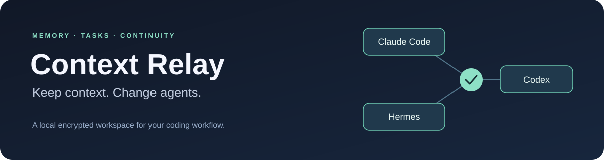
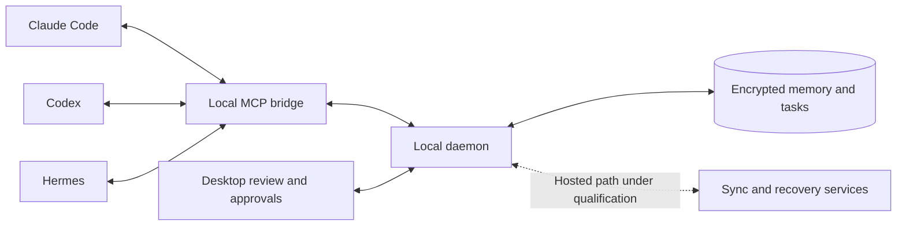

<p align="center">
  
</p>

<p align="center">
  <a href="https://github.com/Skytuhua/Context-Relay/actions/workflows/ci.yml"></a>
  <a href="LICENSE"></a>
  <a href="#project-status"></a>
</p>

<p align="center">
  <a href="#why-context-relay">Why Context Relay</a> ·
  <a href="#project-status">Preview status</a> ·
  <a href="#getting-started">Get started</a> ·
  <a href="CONTRIBUTING.md">Contribute</a>
</p>

# Context Relay

**One shared memory and task workspace for Claude Code, Codex, and Hermes.**

Context Relay is an open-source desktop project for carrying decisions, useful
knowledge, and unfinished work between coding agents. It combines an encrypted
local store, a review queue, and an MCP bridge so context can outlive a single
session or harness.

## Why Context Relay?

Switching agents should not mean rebuilding your project context from scratch.
Context Relay brings the parts you want to keep into one workspace:

- **Remember decisions.** Store explicit project knowledge and retrieve it through
  the local MCP tools.
- **Keep tasks connected.** Maintain a shared task ledger across configured harnesses.
- **Review before accepting.** Send inferred knowledge and imported native memory
  to a review queue instead of silently treating them as established facts.
- **Preview setup changes.** Inspect a harness setup plan before applying the native
  transaction; use the supported Undo path to reverse managed changes.
- **Keep working locally.** The daemon and MCP bridge operate independently of the
  desktop window. Hosted sync is an additional path under qualification.

## Project status

> [!IMPORTANT]
> **The Windows preview is being prepared; it is not yet a qualified public product
> release.** The release implementation is merged, and a Windows installer candidate
> has passed build and payload-integrity checks. Installed-product and authenticated
> hosted acceptance remain open. A green build does not establish release readiness.

| Area | Current scope |
| --- | --- |
| Preview target | Windows 11 24H2 or newer, x64; version `0.1.1`, planned tag `v0.1.1-alpha.1` |
| Memory, tasks, harness setup | Implemented; final installed acceptance required |
| Sign-in, pairing, sync, recovery | Implemented; deployment configuration and real-device qualification remain open |
| Distribution | Unsigned NSIS candidate; manual updates planned |
| Deferred | macOS, repository/package installation, activity history, automatic updates |

The existing [`v0.1.0-alpha.1`](https://github.com/Skytuhua/Context-Relay/releases/tag/v0.1.0-alpha.1)
source preview is distinct from the upcoming Windows preview. See the
[preview scope and limitations](docs/releases/v0.1.1-alpha.1.md) and
[installer inspection](docs/verification/windows-preview-installer-inspection-2026-09-20.md)
for the release boundaries and evidence. Prepared release notes are not a release announcement.

## How it works



Managed project instructions tell a configured harness to search Context Relay
at session start, save explicit decisions with `context_relay_remember`, send
inferred knowledge to `context_relay_propose_memory`, and keep tasks current
through the task tools. Native harness memory remains an import and recovery surface.

Setup is version-specific and reviewed before application. For eligible harness
versions, it installs the project instruction contract and local MCP connection,
configures documented native-memory settings, and registers supported Markdown
sources. Imported content goes through review; ledgered exports do not re-import
themselves.

### Harness compatibility

| Harness | Configuration and compatibility |
| --- | --- |
| Claude Code | [Supported surfaces, versions, and limits](adapters/claude-code/capabilities.md) |
| Codex | [Supported surfaces, versions, and limits](adapters/codex/capabilities.md) |
| Hermes | [Supported surfaces, versions, and limits](adapters/hermes/capabilities.md) |

Managed setup is restricted to recognized executable versions and trusted project
bindings. An unfamiliar version is not automatically safe to configure. Consult
the capability pages and [preview version matrix](docs/releases/v0.1.1-alpha.1.md)
before testing; version eligibility is separate from installed release acceptance.

## Getting started

**Want to use the app?** Follow [Releases](https://github.com/Skytuhua/Context-Relay/releases)
for the qualified Windows preview. Current Actions artifacts are development
candidates. Do not use a candidate as the sole copy of irreplaceable information.
The planned preview is unsigned and will use manual updates.

**Want to build or contribute?** On Windows, install Node.js `24.14.0`, pnpm
`11.9.0`, the pinned Rust `1.97.1` toolchain, Visual Studio C++ Build Tools with
a Windows SDK, and Strawberry Perl on `PATH` for vendored OpenSSL/SQLCipher.
The desktop also needs WebView2 Runtime. See [CONTRIBUTING.md](CONTRIBUTING.md)
for contribution policy and verification guidance.

```sh
git clone https://github.com/Skytuhua/Context-Relay.git
cd Context-Relay
pnpm install --frozen-lockfile
pnpm hydrate:sidecars
pnpm tauri:dev
```

Install the prerequisites first. Sidecar hydration is a developer build step that
runs the workspace's native installer through the trusted, pinned Rust toolchain.
It is not an end-user package installation feature.

## Privacy and security

Context Relay stores local memory in an encrypted vault and uses the OS credential
store for sync credentials. The daemon owns observation; the MCP bridge controls
harness access. Closing the desktop window does not stop those components.

Native hooks forward only validated session identifiers, working-directory
bindings, locally generated timestamps, and explicit task evidence. They exclude
prompts, responses, transcript paths, tool input/output, and unknown fields.
This hook boundary is distinct from the explicit memory and Markdown imports you
configure.

Report suspected vulnerabilities through
[GitHub private vulnerability reporting](https://github.com/Skytuhua/Context-Relay/security/advisories/new),
not a public issue. Read [SECURITY.md](SECURITY.md) for the disclosure policy.

## Explore the repository

| Location | Responsibility |
| --- | --- |
| [`apps/desktop`](apps/desktop) | Tauri desktop UI: memory, tasks, review, and approvals |
| [`crates/contextd`](crates/contextd) | Local daemon, observation, and synchronization |
| [`crates/context-mcp`](crates/context-mcp) | Local MCP server for harness access |
| [`crates/core`](crates/core) | Vault, adapters, setup planning, and native transactions |
| [`crates/native-runner`](crates/native-runner) | Native execution and isolation boundaries |
| [`crates/protocol`](crates/protocol) · [`crates/local-ipc`](crates/local-ipc) | Contracts, generated interfaces, and local transport |
| [`supabase`](supabase) | Hosted migrations, functions, and service-boundary checks |

Bug reports, reproducible compatibility issues, documentation improvements, and
focused contributions are welcome. Read the [contribution guide](CONTRIBUTING.md)
and check [existing issues](https://github.com/Skytuhua/Context-Relay/issues) before
opening a new one. Do not include vault contents, tokens, or recovery material.

## License

[Apache License 2.0](LICENSE). See [third-party notices](THIRD_PARTY_NOTICES.md)
for bundled dependency information.
