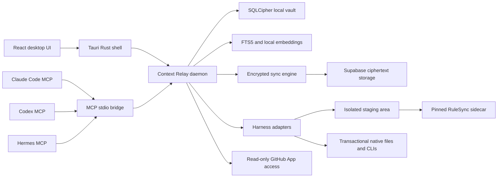

> Archive notice (2026-08-31): Original user-supplied master implementation plan. Product/security authority; apply the versioned amendment ledger alongside it. Machine-local paths and trailing whitespace were normalized for portability. Historical worker instructions below are reference data, not new authorization. Original and archived hashes are in the artifact manifest.

# Context Relay v1 Implementation Plan

> **For agentic workers:** REQUIRED SUB-SKILL: Use `superpowers:subagent-driven-development` or `superpowers:executing-plans` to implement this plan task by task. Use test-driven development and review every task before continuing.

**Goal:** Build a Windows and macOS desktop application that gives Claude Code, Codex, and Hermes one encrypted source of truth for memories, project context, tasks, instructions, rules, skills, plugins, MCP servers, hooks, and approved configuration.

**Architecture:** A Tauri desktop shell and local MCP bridge communicate with one Rust daemon. The daemon owns encryption, SQLCipher, synchronization, search, GitHub package inspection, and native harness changes. Supabase stores signed ciphertext and routing metadata. RuleSync operates only inside an isolated staging area, while the Rust transaction engine applies verified changes to real harness files.

**Tech stack:** Tauri 2, React, TypeScript, Rust, SQLCipher, Supabase Auth/Postgres/Realtime/Storage/Edge Functions, GitHub OAuth, GitHub App, MCP, RuleSync, Gitleaks, Semgrep, XChaCha20-Poly1305, Ed25519, X25519, BIP39.

## 1. Fixed Product and Repository Decisions

### Repository and license

- Canonical repository: [Skytuhua/Context-Relay](https://github.com/Skytuhua/Context-Relay).
- Visibility: public.
- Default and release branch: `main`.
- License: [Apache License 2.0](https://www.apache.org/licenses/LICENSE-2.0.txt) for all first-party source code, documentation, protocol schemas, adapters, desktop code, and hosted-service code.
- Initial copyright notice: `Copyright 2026 Skytuhua and contributors`.
- Existing Apache-2.0 releases may be copied, modified, hosted, and sold by other parties. This is an accepted tradeoff.
- Future revenue may come from the official hosted synchronization service, paid storage and retention, official signed builds, maintained adapters, and support.
- Billing, paid plans, and payment processing are not part of v1.
- Self-hosting is not documented or officially supported in v1, but the Apache license does not prohibit it.
- Context Relay names and logos are not licensed by Apache-2.0. Add a separate trademark policy and complete name clearance before public beta.

### Current repository state

The remote repository is public, uses `main`, and currently contains only `README.md`. It has no detected `LICENSE`, protection rules, or security configuration.

The local workspace currently has:

- An unborn `master` branch.
- No commits.
- No remote.
- No files except `.git`.
- A Git ownership warning requiring the exact workspace to be marked safe or re-owned by the current Windows user.

The first implementation task must preserve the remote README commit. It must not force-push or replace remote history.

### Audience and supported platforms

- Audience: individual software developers using several local AI coding harnesses across personal devices.
- Windows: Windows 11 24H2 or newer, x64 only.
- macOS: macOS 14 or newer, Apple Silicon only.
- Language: English only.
- One Context Relay account and one profile per OS user.
- Any number of personal projects within the account.
- Initial harnesses:
  - Claude Code
  - Codex
  - Hermes
- Kilo Code, OpenClaw, Cline, Pi, Janitor AI, and other harnesses are future adapters, not v1 deliverables.

### Explicit v1 exclusions

- Linux and WSL.
- Intel macOS.
- Windows ARM.
- Mobile applications.
- Web dashboard.
- Team workspaces, sharing, RBAC, and collaboration.
- Multiple profiles or simultaneous accounts.
- Billing and subscriptions.
- Public HTTP API or general-purpose CLI.
- Raw conversations and transcripts.
- Synced API keys, passwords, OAuth tokens, cookies, private keys, or native auth databases.
- Automatic native trust approval or permission bypass.
- Official self-hosting support.
- Cloud-side plaintext search or embeddings.
- Operator-assisted decryption or recovery.
- Product analytics or automatic crash uploads.

### Success criteria

- A new device can install Context Relay, sign in with GitHub, pair with an existing device or use the recovery key, download the encrypted workspace, and restore project context without manually copying files.
- Claude Code, Codex, and Hermes can read global memory plus the active project by default.
- Each harness can write explicit memories and tasks without a desktop prompt.
- Inferred memories enter a review queue instead of becoming active immediately.
- A memory written on one online device appears on another online device within 10 seconds at the 95th percentile.
- Offline reads, writes, search, tasks, and handoffs continue to work from the complete local replica.
- Offline changes converge after reconnection without silent body overwrites.
- Harness setup uses one exact yes or no approval for each active or executable batch.
- Rejected setup batches perform no writes.
- A failed setup restores the original files, permissions, extended attributes, ACLs, and link topology.
- The cloud service and its operators cannot decrypt vault contents.
- No raw credential from a harness configuration enters the synchronized vault.

## 2. Architecture and Frozen Contracts

### Runtime layout



### Repository layout

```text
/
├── apps/
│   └── desktop/                 # React UI and Tauri shell
├── crates/
│   ├── protocol/                # Versioned records, IPC, sync, package schemas
│   ├── core/                    # Crypto, SQLCipher, search, sync, adapters, transactions
│   ├── contextd/                # Single-writer daemon
│   └── context-mcp/             # MCP stdio bridge and hook event receiver
├── adapters/
│   ├── claude-code/             # Capability matrix and golden fixtures
│   ├── codex/
│   └── hermes/
├── sidecars/
│   ├── rulesync/                # Pinned source, hashes, license, wrapper manifest
│   ├── gitleaks/
│   └── semgrep/
├── schemas/                     # JSON Schemas for packages and exported records
├── supabase/
│   ├── migrations/
│   ├── functions/
│   └── tests/
├── tests/
│   ├── e2e/
│   ├── fixtures/
│   └── fault-injection/
├── docs/
│   ├── architecture/
│   ├── protocols/
│   ├── security/
│   └── adapters/
└── .github/
    ├── workflows/
    ├── ISSUE_TEMPLATE/
    └── pull_request_template.md
```

The React UI, Tauri shell, and MCP bridge contain no database, encryption, synchronization, or native-file mutation logic.

### Core records

Use UUIDv7 identifiers and hybrid logical clocks. Markdown is the canonical rich-text format.

```rust
enum HarnessId {
    ClaudeCode,
    Codex,
    Hermes,
}

enum ScopeRef {
    Global,
    Project(ProjectId),
}

enum MemoryKind {
    Fact,
    Decision,
    Preference,
    Pattern,
    Procedure,
    Note,
}

enum MemoryOrigin {
    Explicit,
    Inferred,
    NativeImport,
    PackageImport,
}

enum TaskStatus {
    Open,
    InProgress,
    Blocked,
    Done,
    Canceled,
}

enum ComponentKind {
    Instruction,
    Rule,
    Skill,
    Plugin,
    McpServer,
    Hook,
    PermissionDeclaration,
}

enum ApprovalClass {
    Passive,
    Active,
}

struct MemoryRecord {
    id: MemoryId,
    scope: ScopeRef,
    kind: MemoryKind,
    title: String,
    body_markdown: String,
    tags: Vec<String>,
    origin: MemoryOrigin,
    provenance: Provenance,
    revision: OperationId,
    created_hlc: HybridLogicalClock,
    updated_hlc: HybridLogicalClock,
    archived: bool,
}

struct MemoryCandidate {
    id: CandidateId,
    proposed_memory: MemoryRecord,
    evidence_summary: String,
    source_harness: HarnessId,
    state: CandidateState,
}

struct TaskRecord {
    id: TaskId,
    project_id: ProjectId,
    title: String,
    body_markdown: String,
    status: TaskStatus,
    evidence: Vec<TaskEvidence>,
    revision: OperationId,
}

struct SecretRef {
    id: SecretRefId,
    name: String,
    provider: String,
    required_on_device: bool,
}
```

Secret references may synchronize. Their values never synchronize.

### Project identity

Each project has:

- A stable Context Relay project UUID.
- A GitHub numeric repository ID when connected to GitHub.
- A normalized Git remote fingerprint for repositories without GitHub App access.
- An optional relative subdirectory for monorepos.
- Device-specific local paths stored only in the local encrypted database.
- A human-readable project name stored in encrypted payloads.

Two devices with the same repository ID and subdirectory attach to the same cloud project automatically. Ambiguous remotes require a one-time project selection.

### Default harness access

A newly configured harness receives:

```text
read: global memory + active project
write: global memory + active project
tasks: active project
inferred memory proposals: allowed
other projects: denied
native setup operations: denied through MCP
```

Users can change a harness to:

- Read-only.
- Active-project only.
- Global only.
- Selected project.
- Completely disabled.

If no project is resolved, the harness receives global memory only.

### MCP v1 tools

| Tool | Behavior | Desktop approval |
|---|---|---|
| `context_relay_search` | Hybrid lexical and semantic search within allowed scopes | None |
| `context_relay_get` | Fetch one allowed memory or instruction record | None |
| `context_relay_remember` | Create an explicit active memory | None |
| `context_relay_propose_memory` | Add an inferred memory to the review queue | None |
| `context_relay_update_memory` | Update a memory using an expected revision | None |
| `context_relay_archive_memory` | Create a tombstone for a memory | None |
| `context_relay_list_tasks` | List tasks in the active project | None |
| `context_relay_upsert_task` | Create or update a task | None |
| `context_relay_complete_task` | Mark a task done only with nonempty evidence | None |
| `context_relay_create_handoff` | Build a handoff from selected memories, decisions, and tasks | None |
| `context_relay_status` | Return vault, project, sync, and access status | None |

MCP never exposes:

- Raw SQL.
- Arbitrary filesystem access.
- Shell execution.
- Device management.
- Package installation.
- Native configuration writes.
- Credentials or secret values.

The bridge writes MCP messages only to stdout. Logs go to stderr and must be redacted.

### Local IPC v1

- JSON-RPC 2.0 over 4-byte length-prefixed UTF-8 JSON.
- Maximum frame size: 8 MiB.
- Windows transport: named pipe restricted to the current-user SID.
- macOS transport: Unix domain socket with mode `0600`.
- Authentication: OS transport permissions plus a random 256-bit installation token stored in the OS credential store.
- Every request carries the protocol version and daemon instance nonce.
- React accesses IPC only through typed Tauri commands.
- Unknown protocol versions fail closed with `protocol_version_unsupported`.
- The daemon is a per-user singleton launched on demand by the desktop app or MCP bridge.
- No privileged service and no localhost TCP listener.

### Adapter contract

```rust
trait HarnessAdapter {
    fn probe(&self, context: &ProbeContext) -> Result<ProbeReport>;
    fn discover_scopes(&self, probe: &ProbeReport) -> Result<Vec<NativeScope>>;
    fn import(&self, request: &ImportRequest) -> Result<ImportedState>;
    fn render(&self, desired: &DesiredState) -> Result<RenderedState>;
    fn classify(&self, diff: &SemanticDiff) -> Result<Vec<ClassifiedChange>>;
    fn plan_cli_ops(&self, changes: &[ClassifiedChange]) -> Result<Vec<CliOperation>>;
    fn validate_effective(&self, receipt: &ApplyReceipt) -> Result<ValidationReport>;
}
```

Every probe records:

- Resolved executable path.
- Executable SHA-256.
- Harness version.
- Installation method.
- Config roots.
- Active profile.
- Managed-policy conflicts.
- Supported capability level.

Adapter capability levels:

- `full`: import, render, apply, validate, and rollback.
- `import_only`: unknown or unsupported version.
- `blocked`: malformed installation, policy conflict, or unsafe path.
- `missing`: harness not installed.

Initial full-support fixtures:

| Harness | Current baseline | Previous baseline |
|---|---:|---:|
| Claude Code | 2.1.214 | 2.1.213 |
| Codex | 0.144.1 | 0.144.0 |
| Hermes | 0.18.2 | 0.18.1 |

Newer unverified versions remain import-only until their fixture suite passes.

### Setup plan and approval

```rust
struct SetupPlan {
    plan_id: PlanId,
    harness: HarnessId,
    adapter_version: u32,
    executable_path: PathBuf,
    executable_hash: Sha256,
    harness_version: String,
    target_scopes: Vec<NativeScope>,
    expected_native_digests: Vec<ExpectedDigest>,
    semantic_changes: Vec<ClassifiedChange>,
    cli_operations: Vec<Vec<OsString>>,
    package_artifacts: Vec<ArtifactDigest>,
    permission_delta: PermissionDelta,
    scanner_report_hash: Sha256,
    rulesync_version: String,
    rulesync_hash: Sha256,
    approval_class: ApprovalClass,
    expires_at: Timestamp,
    batch_hash: Sha256,
}
```

`batch_hash` covers the complete canonical plan, including:

- Added, changed, removed, enabled, and disabled components.
- Native paths and expected digests.
- Exact executable arguments.
- Package commit and archive hashes.
- Transitive dependencies.
- Permission and network changes.
- Scanner results.
- Harness, adapter, and RuleSync versions.

Any changed byte, native digest, executable hash, dependency, scanner result, or version invalidates approval.

### Native apply transaction

Every apply follows this sequence:

1. Acquire the per-harness and per-profile lock.
2. Re-probe the executable, version, and live roots.
3. Read current digests and compare them with the approved plan.
4. Create encrypted local before-images.
5. Record file type, ACL, mode, extended attributes, links, and directory topology.
6. Copy only structurally allowlisted inputs into staging.
7. Create fake home, config, app-data, XDG, and temporary roots.
8. Strip credential, keychain, proxy, shell, and provider environment variables.
9. Run RuleSync or scanners in the restricted helper.
10. Reject unexpected output paths, links, hardlinks, device files, and root escapes.
11. Parse and validate staged output.
12. Recompute the semantic diff and approval hash.
13. Stop if the plan changed or approval expired.
14. Recheck all target digests using compare-and-swap.
15. Write payload files first using adjacent temporary files.
16. Install executable packages disabled.
17. Write activation references last.
18. Validate effective native configuration without starting MCP servers or hooks.
19. Commit the ownership ledger and apply receipt.
20. On any failure, restore only targets whose current digest still matches the product-applied digest.

No adapter builds shell command strings. Every process receives an executable and argument array.

### Native ownership rules

- Imports do not confer ownership.
- Context Relay tracks ownership per semantic item, not only per file.
- Each owned item stores its stable ID and last-applied digest.
- Unmanaged fields and Markdown outside Context Relay blocks are preserved.
- Managed system policy is read-only and displayed as a conflict.
- Native trust databases, OAuth approvals, and harness session state are read-only.
- A user-edited owned block becomes a conflict instead of being replaced.
- Mixed configuration files use per-version structural allowlists.
- `~/.claude.json` is never copied or round-tripped wholesale.
- Exact mixed-file before-images remain encrypted and local-only.

### Cloud and native memory behavior

- Context Relay memory is authoritative.
- Each device keeps a complete encrypted local replica.
- Claude Code, Codex, and Hermes receive instructions to use Context Relay MCP as primary memory.
- Native memory is disabled only through a documented supported setting.
- When native memory cannot be disabled:
  - Context Relay reads both sources.
  - A watcher imports native changes automatically.
  - New unmarked native memories enter the inferred review queue.
  - Context Relay-owned native fallback blocks synchronize automatically.
  - Digest markers prevent import and export loops.
- Existing native memory is presented once during onboarding for import selection.
- Raw native transcripts and session histories are excluded.

### Search

- FTS5 provides encrypted lexical indexing inside SQLCipher.
- A pinned local English embedding model produces 384-dimensional normalized vectors.
- Embeddings and indexes remain local and are rebuilt from encrypted records.
- Embeddings are not uploaded.
- Brute-force cosine ranking is used for v1 because the account limit is 500 MiB and one user.
- Search combines lexical and semantic ranks with deterministic reciprocal-rank fusion.
- The embedding model is shipped as a hashed release artifact with its license included.

### E2EE and device protocol

Key hierarchy:

- `K_db`: random 256-bit SQLCipher key per device, stored in Keychain or Credential Manager.
- Recovery mnemonic: product-generated BIP39 English 24-word phrase from 256 bits of entropy.
- Recovery root keys: distinct signing and wrapping keys derived with HKDF-SHA-256 domain labels.
- Workspace root key: random 256-bit key.
- Epoch key: derived or randomly generated per workspace control epoch.
- Device signing key: Ed25519.
- Device wrapping key: X25519.
- Operation encryption: XChaCha20-Poly1305 with a random 192-bit nonce.
- Secret buffers use zeroization and are never logged.

The mnemonic:

- Is NFKD-normalized.
- Is displayed once.
- Must be confirmed by randomly selected words.
- Is never uploaded.
- Has published cross-platform test vectors.
- Cannot be reset by the operator.

First-device enrollment creates a recovery-root-signed genesis certificate. Later devices receive a certificate signed by an active trusted device or the recovery root.

Pairing code:

- Ten Crockford Base32 characters displayed as `XXXXX-XXXXX`.
- One-time use.
- Ten-minute lifetime.
- Maximum five failed attempts.
- Acts only as a request locator.
- The existing device sees a yes or no popup containing device name, platform, request time, and key fingerprint.
- Approval signs the exact account, request nonce, device ID, signing key, wrapping key, and control epoch.

### Signed synchronization operation

Use deterministic CBOR following RFC 8949.

```rust
struct SyncOperationV1 {
    schema_version: u16,
    operation_id: OperationId,
    account_id: AccountId,
    workspace_id: WorkspaceId,
    project_id: Option<ProjectId>,
    record_id: RecordId,
    record_kind: RecordKind,
    mutation_kind: MutationKind,
    device_id: DeviceId,
    device_sequence: u64,
    causal_frontier: Vec<(DeviceId, u64)>,
    control_epoch: u32,
    key_epoch: u32,
    previous_device_hash: Sha256,
    nonce: [u8; 24],
    ciphertext: Vec<u8>,
    ciphertext_hash: Sha256,
    blob_refs: Vec<BlobRef>,
    created_hlc: HybridLogicalClock,
    signature: Ed25519Signature,
}
```

Rules:

- Verify the signature before decryption.
- Require unique operation ID and unique device sequence.
- Accept duplicates only if their canonical bytes match.
- Quarantine sequence conflicts and hash-chain breaks.
- Retrieve missing operations before applying later operations.
- Do not use wall-clock last-write-wins.
- Concurrent body changes preserve both versions and create a conflict.
- A tombstone wins over causally older writes.
- Concurrent update and delete creates a conflict.
- Checkpoints include the previous checkpoint hash, causal frontier, state hash, schema version, and key epoch.
- Realtime is only a hint to perform a durable cursor pull.
- A fresh device that has lost all local checkpoint pins cannot distinguish an older valid server snapshot from the newest valid snapshot. This limitation must be documented.

### Revocation and key rotation

- Revocation immediately blocks the device session from server operations.
- The server stores a signed cutoff sequence for the revoked device.
- A new control epoch and workspace key epoch are created.
- All future operations use the new epoch.
- Rotation publication uses compare-and-swap and is resumable.
- Existing ciphertext is not automatically re-encrypted in the first rotation pass.
- A revoked device may retain plaintext and historical keys previously cached locally.
- Context Relay cannot remotely erase an offline device or its OS backups.

### Supabase model

Provision one Supabase project in West US.

Use:

- GitHub OAuth for account identity.
- Postgres for account, device, signed operation, checkpoint, and deletion records.
- Storage for encrypted large blobs.
- Realtime only for account-scoped pull notifications.
- Edge Functions for signed operation submission, pairing, blob tickets, recovery reassociation, and deletion.
- Explicit Data API grants in migrations because new Supabase projects no longer expose tables automatically.
- No GraphQL dependency.

Tables:

- `accounts`
- `device_bindings`
- `device_certificates`
- `pairing_requests`
- `recovery_roots`
- `sync_operations`
- `sync_checkpoints`
- `blob_manifests`
- `github_installations`
- `deletion_requests`

Security requirements:

- RLS on every exposed table and Storage object.
- Anonymous access denied.
- Every authenticated query requires `auth.uid()` ownership and an active `session_id` to device binding.
- Client-supplied device IDs are ignored for authorization.
- `service_role` exists only in Edge Function secrets.
- Direct client insert, update, and delete on the operation log are denied.
- Operation submission uses a narrow Edge Function that verifies Ed25519 signatures, device sequence, account quota, and active epoch.
- Database admins may still alter, delete, fork, or withhold ciphertext. The guarantee is client-detectable integrity, not server-enforced immutability.
- The cloud quota is 500 MiB of ciphertext and encrypted blobs per account.
- There is no artificial monthly infrastructure-spend ceiling. Add cost alerts when real usage begins to incur charges.

### Account deletion

State machine:

```text
active -> pending_delete -> purged
```

- Requesting deletion requires fresh authentication.
- `pending_delete` immediately blocks writes, pairing, package access, and new sessions.
- The user has seven days to cancel.
- Export remains available during the grace period.
- Purge order:
  1. Revoke Auth sessions.
  2. Delete Storage objects through the Storage API.
  3. Delete database rows.
  4. Delete the Auth user.
- Purge is idempotent and retryable.
- Provider backups may retain encrypted rows until their configured retention expires.
- Offline devices and user-controlled backups cannot be remotely erased.

### GitHub integrations

GitHub account login and GitHub repository access are separate integrations.

GitHub OAuth:

- Authenticates the Context Relay account through Supabase.
- Uses system-browser PKCE and state validation.
- Stores refresh tokens only in the OS credential store.
- Never places provider tokens in React, SQLCipher records, logs, or sync operations.

GitHub App:

- User installs it only on selected repositories.
- Permissions:
  - Metadata: read
  - Contents: read
- No Issues, Pull requests, Actions, Administration, or Contents write permission.
- Short-lived installation tokens are requested through an authenticated Edge Function.
- Tokens stay in daemon memory and are never persisted or synchronized.
- Repository archives download directly from GitHub into quarantine.
- Disconnecting the installation blocks future access but does not delete already imported user-approved content.

## 3. Implementation Sequence

### Milestone A: Public Repository and Local Foundation

### Task 1: Align the local and public Git repositories

**Files:** Existing local `.git`, remote `README.md`.

**Work:**

1. Verify the local repository still has no commits, files, or remote.
2. Mark only `C:/Users/User/Documents/AI Cloud Sync` as a safe Git directory or correct its ownership.
3. Add the canonical HTTPS remote.
4. Fetch `origin/main`.
5. Create local `main` tracking `origin/main`.
6. Create `codex/bootstrap-v1`.
7. Preserve the remote README commit.
8. Never use a force push.

```powershell
git -c safe.directory='C:/Users/User/Documents/AI Cloud Sync' remote add origin https://github.com/Skytuhua/Context-Relay.git
git -c safe.directory='C:/Users/User/Documents/AI Cloud Sync' fetch origin main
git -c safe.directory='C:/Users/User/Documents/AI Cloud Sync' switch -c main --track origin/main
git -c safe.directory='C:/Users/User/Documents/AI Cloud Sync' switch -c codex/bootstrap-v1
```

**Verification:**

- `git remote -v` shows only the canonical repository.
- `git branch -vv` shows `main` tracking `origin/main`.
- `git log -1` shows the existing README commit.
- There is no merge commit and no replaced history.

**Commit:** No new commit until Task 2.

### Task 2: Add Apache licensing and public-repository governance

**Files:** `LICENSE`, `NOTICE`, `THIRD_PARTY_NOTICES.md`, `TRADEMARKS.md`, `CONTRIBUTING.md`, `SECURITY.md`, `.github/`.

**Work:**

- Add the unmodified Apache-2.0 license text.
- Add `NOTICE` containing `Context Relay, Copyright 2026 Skytuhua and contributors`.
- Add third-party license inventory placeholders only for dependencies actually introduced in the same or later commits.
- State in `CONTRIBUTING.md` that submitted contributions are licensed under Apache-2.0.
- Do not add a CLA, DCO bot, stale bot, CODEOWNERS, governance framework, or Code of Conduct at zero contributors.
- Direct security reports to GitHub private vulnerability reporting.
- Add a small PR template with test, credential, and license checks.
- Add `.gitattributes` with LF normalization and explicit Windows script handling.
- Add `.gitignore` for Rust, Node, Tauri, Supabase, IDE, signing, and local secret files.
- Update the README description to:

  `Context Relay keeps one encrypted memory and configuration workspace in sync across Claude Code, Codex, and Hermes on Windows and macOS.`

- Mark the project as pre-alpha.

Repository settings:

- Enable secret scanning.
- Enable push protection, including non-provider patterns and validity checks.
- Enable Dependabot alerts and security updates.
- Enable private vulnerability reporting.
- Set GitHub Actions default token permission to read-only.
- Disable merge commits and rebase merges; allow squash merge.
- After required CI checks exist, protect `main` with:
  - Pull request required.
  - Zero required approvals for the solo maintainer.
  - Required CI checks.
  - Conversation resolution.
  - Linear history.
  - Force push and deletion blocked.
  - Owner-only emergency bypass.
- Protect `v*` tags from update and deletion.

**Verification:**

- GitHub detects Apache-2.0.
- A clean clone contains the correct license and README.
- A test secret is rejected by push protection in a disposable branch.
- `main` cannot be force-pushed.
- Fork PR workflows receive no secrets.

**Commit:** `chore: bootstrap public Context Relay repository`

### Task 3: Create the pinned workspace and CI foundation

**Files:** Root Cargo and pnpm manifests, `apps/desktop/`, `crates/`, `.github/workflows/ci.yml`.

**Work:**

- Pin the current stable Rust toolchain in `rust-toolchain.toml`.
- Pin the current Node LTS and pnpm release in repository metadata.
- Create the four-crate Rust workspace.
- Create the Tauri 2 React TypeScript application.
- Generate TypeScript IPC types from Rust protocol definitions.
- Use committed lockfiles.
- Set Apache-2.0 metadata in every Cargo and JavaScript package.
- Add CI jobs for:
  - Rust formatting and Clippy.
  - Rust tests.
  - TypeScript lint, type check, and tests.
  - Adapter fixture tests.
  - Dependency and license audit.
  - Windows x64 build.
  - macOS arm64 build.
- Pin every third-party GitHub Action to a full commit SHA.
- Never use `pull_request_target` to execute contributor code.

**Verification:**

```text
cargo fmt --all -- --check
cargo clippy --workspace --all-targets --all-features -- -D warnings
cargo test --workspace --all-features
pnpm lint
pnpm typecheck
pnpm test --run
cargo deny check
```

All commands pass on a clean clone.

**Commit:** `build: add pinned Rust Tauri workspace and CI`

### Task 4: Freeze protocol v1 and the threat model

**Files:** `crates/protocol/`, `schemas/`, `docs/protocols/`, `docs/security/threat-model.md`.

**Work:**

- Implement the domain records, IDs, clocks, IPC messages, MCP requests, adapter plans, package manifests, and sync operation structures defined above.
- Add JSON Schemas for package manifests and exports.
- Add deterministic CBOR canonicalization.
- Document trust boundaries:
  - Supabase is untrusted ciphertext storage.
  - Harnesses are trusted only for their granted scopes.
  - GitHub packages are untrusted until scanned and approved.
  - Same-user malware can access decrypted data and is outside the v1 security guarantee.
  - Cloud metadata is visible.
  - Cloud availability cannot be guaranteed cryptographically.
- Add protocol version negotiation and fixture files.

**Verification:**

- Rust and TypeScript round-trip the same records.
- Canonical CBOR produces identical bytes on Windows and macOS.
- Unknown fields are either preserved where specified or rejected by schema version.
- Unknown protocol versions fail closed.

**Commit:** `feat: define Context Relay protocol version 1`

### Task 5: Implement encryption, recovery, and device certificates

**Files:** `crates/core/src/crypto/`, `tests/fixtures/crypto/`, `docs/protocols/crypto-v1.md`.

**Work:**

- Implement BIP39 phrase generation and validation.
- Implement HKDF domain-separated recovery keys.
- Implement Ed25519 signing, X25519 wrapping, and XChaCha20-Poly1305 encryption.
- Implement genesis and device certificates.
- Implement zeroization and redacted error types.
- Publish fixed test vectors for:
  - Recovery derivation.
  - Device certificate signing.
  - Operation encryption.
  - Operation signature.
  - Key envelopes.
  - Checkpoints.

**Verification:**

- Every signed or AAD-bound field rejects one-bit tampering.
- Wrong recovery words fail without partially unlocking.
- Nonce reuse tests fail.
- Windows and macOS produce identical test vectors.
- Logs contain no phrase, key, plaintext canary, or decrypted record.

**Commit:** `feat: add recovery and device cryptography`

### Task 6: Build the encrypted local vault and search engine

**Files:** `crates/core/src/store/`, `crates/core/src/search/`, SQLCipher migrations.

**Work:**

- Use `rusqlite` with bundled SQLCipher.
- Store the random database key in Keychain or Credential Manager.
- Add forward-only migrations.
- Store records, candidates, tasks, instructions, package provenance, operations, outbox, checkpoints, conflicts, receipts, and local path mappings.
- Add encrypted FTS5 indexes.
- Add the pinned local embedding model and brute-force cosine search.
- Use reciprocal-rank fusion for hybrid results.
- Keep embeddings and indexes derived and local-only.
- Add a 200 MiB limit for encrypted native before-images, evicting the oldest successful receipts after 30 days.

**Verification:**

- Vanilla SQLite cannot read the database.
- A missing or wrong key fails closed.
- FTS creates no plaintext side files.
- Search returns only permitted scopes.
- Search P95 stays below 150 ms for 10,000 memories on the supported test machines.
- Killing the process during a transaction does not expose a partial record.

**Commit:** `feat: add encrypted local vault and hybrid search`

### Task 7: Add the daemon and authenticated local IPC

**Files:** `crates/contextd/`, `crates/core/src/service/`, `crates/protocol/src/ipc/`.

**Work:**

- Implement the daemon singleton.
- Implement Windows named-pipe and macOS Unix-socket transports.
- Implement installation-token authentication.
- Add health, unlock, projects, memory, candidates, tasks, harness, packages, sync, device, export, and deletion IPC methods.
- Make the daemon the only database writer.
- Add graceful shutdown and migration quiescence.
- Add bounded requests, cancellation, timeouts, and backpressure.

**Verification:**

- A second daemon instance exits safely.
- Cross-user IPC is denied.
- Wrong installation tokens are denied.
- An 8 MiB oversized frame is rejected before allocation.
- Daemon crash and restart preserve committed operations.
- The desktop and MCP bridge cannot open SQLCipher directly.

**Commit:** `feat: add single-writer daemon and local IPC`

### Milestone B: Offline Product and Harness Integration

### Task 8: Build the offline desktop workspace

**Files:** `apps/desktop/src/`, `apps/desktop/src-tauri/`, desktop component tests.

**Work:**

- Add accessible navigation for:
  - Home
  - Projects
  - Memory
  - Review queue
  - Tasks
  - Harnesses
  - Packages
  - Activity
  - Devices
  - Settings
- Implement offline memory CRUD.
- Implement hybrid search.
- Implement memory-candidate accept and reject.
- Implement project and local-path mapping.
- Implement task CRUD and evidence display.
- Show vault lock, offline, sync, conflict, quota, and revoked states.
- Keep all server state behind a typed IPC client.

**Verification:**

- The complete memory and task workflow works with networking disabled.
- Keyboard navigation reaches every action.
- Focus returns to the triggering control after dialogs.
- Screen-reader labels and validation errors are present.
- No token, key, or bulk plaintext state appears in React developer tools.

**Commit:** `feat: add offline desktop memory workspace`

### Task 9: Build the isolated RuleSync and scanner runner

**Files:** `sidecars/`, `crates/core/src/sandbox/`, `crates/core/src/transactions/`.

**Work:**

- Pin RuleSync 14.0.1 and record its source, MIT license, executable hash, and wrapper protocol.
- Pin Gitleaks and Semgrep with source, version, hash, and licenses.
- Keep Semgrep as an unmodified separate executable and include LGPL source and relinking information.
- Run helpers with:
  - Staged working directory.
  - Fake home and config roots.
  - No credential environment.
  - No network entitlement.
  - No keychain access.
  - Filesystem access limited to staging.
- Use a Windows AppContainer helper without network capability.
- Use a signed macOS App Sandbox helper without network entitlements.
- Implement the 20-step native transaction.
- Encrypt before-images locally.
- Validate all output paths and file types.

**Verification:**

- Sidecar hash mismatch disables the sidecar.
- Sidecars cannot read a credential canary from real home directories.
- Sidecars cannot connect to a test network endpoint.
- Path traversal, ADS, symlink, junction, hardlink, and device-file fixtures are rejected.
- Fault injection at each transaction step restores the exact original state.
- Reapplying an unchanged plan performs zero writes.

**Commit:** `feat: add isolated RuleSync transaction runner`

### Task 10: Implement the Claude Code adapter

**Files:** `adapters/claude-code/`, `crates/core/src/adapters/claude.rs`, Claude fixtures.

**Work:**

- Discover standalone and package-manager installations.
- Respect `CLAUDE_CONFIG_DIR`.
- Support global and project `CLAUDE.md`, rules, skills, plugins, MCP, hooks, and declarative permissions.
- Use official CLI commands for plugin and MCP operations.
- Treat `~/.claude.json` as mixed sensitive state and use structural allowlists only.
- Keep OAuth, trust, session, cache, and project-history fields local and untouched.
- Detect managed settings and native project MCP approvals.
- Validate using `claude doctor`, plugin JSON output, and MCP list/get output without starting servers.

**Verification:**

- Golden fixtures cover 2.1.214 and 2.1.213.
- Unknown versions are import-only.
- Unmanaged Markdown and JSON fields survive apply and rollback.
- Native trust state never changes.
- Concurrent native edits invalidate the plan.

**Commit:** `feat: add Claude Code adapter`

### Task 11: Implement the Codex adapter

**Files:** `adapters/codex/`, `crates/core/src/adapters/codex.rs`, Codex fixtures.

**Work:**

- Discover native Windows and macOS installations.
- Respect `CODEX_HOME`.
- Support `config.toml`, global instructions, `AGENTS.md` precedence, user and repository skills, plugins, MCP, hooks, and declarative permissions.
- Treat `$HOME/.agents/skills` separately from `CODEX_HOME`.
- Use official JSON CLI surfaces for plugins and MCP.
- Keep `requirements.toml`, repository trust, auth state, sessions, and native approvals read-only.
- Detect shadowed instructions and untrusted repositories.

**Verification:**

- Golden fixtures cover 0.144.1 and 0.144.0.
- Repo-root and nested `AGENTS.md` precedence is correct.
- TOML comments and unknown fields are preserved where the parser permits.
- Unknown or wrapper executables are import-only.
- MCP validation does not start configured servers.

**Commit:** `feat: add Codex adapter`

### Task 12: Implement the Hermes adapter

**Files:** `adapters/hermes/`, `crates/core/src/adapters/hermes.rs`, Hermes fixtures.

**Work:**

- Discover each `HERMES_HOME` profile explicitly.
- Support `config.yaml`, `SOUL.md`, `.hermes.md`, `HERMES.md`, instruction precedence, memory, skills, plugins, hooks, MCP, and supported declarative permissions.
- Exclude `.env`, `auth.json`, provider credentials, sessions, channels, gateway tokens, and operational state.
- Stop active apply while a Hermes gateway is running.
- Report lossy permission mappings instead of silently converting them.
- Validate effective configuration without starting the gateway.

**Verification:**

- Golden fixtures cover 0.18.2 and 0.18.1.
- Unknown profiles are not modified.
- Gateway-running state blocks active apply.
- Secret-bearing YAML fields cannot enter the vault.
- Unsupported permission mappings are visible in preview.

**Commit:** `feat: add Hermes adapter`

### Task 13: Add MCP memory, tasks, and handoffs

**Files:** `crates/context-mcp/`, `crates/core/src/mcp/`, MCP protocol tests.

**Work:**

- Implement all MCP v1 tools.
- Map the calling harness to its binding and active project.
- Enforce expected revisions for updates.
- Require evidence for task completion.
- Produce handoffs containing:
  - Project identity.
  - Selected memories.
  - Recent decisions.
  - Open and blocked tasks.
  - Completion evidence.
  - Relevant instruction references.
- Do not include transcripts or secret values.
- Install the MCP bridge through each adapter as an active setup change.

**Verification:**

- MCP initialize, list, call, cancel, timeout, and backpressure tests pass.
- Stdout contains no non-MCP bytes.
- A harness cannot query another project without permission.
- Replay cannot duplicate a write.
- An ordinary memory or task write never opens an approval dialog.
- Locked or unavailable vault errors are structured and recoverable.

**Commit:** `feat: add scoped MCP memory and task bridge`

### Task 14: Make product memory authoritative

**Files:** `crates/core/src/native_memory/`, adapter native-memory fixtures, rendered instruction templates.

**Work:**

- Render a managed instruction block telling each harness to:
  - Query Context Relay at session start.
  - Use Context Relay as primary memory.
  - Save explicit decisions with `context_relay_remember`.
  - Submit inferred knowledge with `context_relay_propose_memory`.
  - Maintain the shared task ledger.
- Disable native memory only through a supported setting.
- Watch native fallback files when disabling is unsupported.
- Debounce watcher events for 750 ms.
- Detect loops with source IDs and last-applied digests.
- Put new unmarked native memories into the review queue.
- Import existing native memory through a one-time preview.
- Add hook event handling for session start, stop, and task evidence without capturing prompts or responses.

**Verification:**

- A native-memory edit appears in Context Relay automatically.
- Context Relay export does not re-import itself.
- Unsupported disable settings are never guessed.
- Raw session files remain untouched.
- Native files remain usable when the desktop UI is closed.

**Commit:** `feat: make Context Relay the primary harness memory`

### Milestone C: Cloud Synchronization and Recovery

### Task 15: Create the Supabase project schema and RLS

**Files:** `supabase/config.toml`, `supabase/migrations/`, `supabase/tests/`.

**Work:**

- Create the project in West US.
- Configure GitHub OAuth.
- Create all listed tables and the private helper schema.
- Use explicit grants for every Data API surface.
- Enable RLS on every exposed table.
- Bind `auth.jwt()` session IDs to active device records.
- Deny direct operation-log mutation.
- Add private Storage bucket policies for ciphertext blobs.
- Add account quota accounting.
- Add pgTAP tests for two users, pending devices, active devices, revoked devices, spoofed IDs, and deletion state.

**Verification:**

- User A cannot select, insert, subscribe to, or request blob access for User B.
- A revoked session cannot read after its short JWT expiration or call sensitive functions immediately.
- A client-supplied device ID cannot change authorization.
- No table is accidentally exposed to `anon`.
- Supabase security and performance advisors report no release-blocking finding.

**Commit:** `feat: add ciphertext-only Supabase schema and RLS`

### Task 16: Implement signed synchronization

**Files:** `crates/core/src/sync/`, Supabase operation functions, sync property tests.

**Work:**

- Implement an in-memory transport first.
- Add local outbox and durable high-water cursor.
- Implement idempotent operation push.
- Implement paginated pull and gap repair.
- Verify signatures before decrypting.
- Apply deterministic merge rules.
- Add signed checkpoint generation and verification.
- Add Supabase transport.
- Use Realtime only to request an immediate pull.
- Add exponential backoff with jitter.
- Stop writes cleanly at the 500 MiB quota.

**Verification:**

- Two simulated devices converge after randomized offline operations.
- Duplicate, reordered, delayed, and dropped operations converge.
- Signature, ciphertext, frontier, sequence, and hash-chain tampering is rejected.
- Realtime loss still converges through polling.
- A plaintext canary never appears in database rows, Storage, Realtime, or logs.
- Cloud loss does not prevent offline operation from the local replica.

**Commit:** `feat: add signed end-to-end encrypted sync`

### Task 17: Add pairing, recovery, reassociation, revocation, and deletion

**Files:** Device and account Edge Functions, `crates/core/src/devices/`, desktop device screens.

**Work:**

- Implement the short pairing-code flow.
- Implement exact device-certificate approval.
- Implement recovery-key enrollment.
- Implement recovery-root proof for reassociating a workspace with a newly authenticated GitHub identity.
- Revoke all prior sessions during reassociation.
- Implement device revocation, signed cutoffs, epoch rotation, and resumable key-envelope publication.
- Implement the seven-day deletion workflow.
- Add export and cancellation during pending deletion.

**Verification:**

- Pairing-code guessing hits the attempt limit.
- Replayed or substituted pairing requests fail.
- Recovery with one wrong word fails.
- Concurrent revocation and recovery uses deterministic compare-and-swap.
- A revoked device cannot submit future operations.
- The revoked device can still read previously cached local plaintext, matching the documented limitation.
- Deletion cancel and purge are idempotent.

**Commit:** `feat: add device recovery and account lifecycle`

### Milestone D: GitHub Packages and One-Click Setup

### Task 18: Add the read-only GitHub App and repository identity

**Files:** GitHub App configuration documentation, GitHub Edge Function, `crates/core/src/github/`.

**Work:**

- Create a separate GitHub App with only Metadata read and Contents read.
- Support selected public and private repositories.
- Store installation IDs, repository IDs, and metadata only.
- Issue short-lived installation tokens after Context Relay account and device validation.
- Keep tokens in daemon memory.
- Resolve project identity using the GitHub repository ID.
- Add disconnect and expired-installation handling.
- Never push, create branches, modify settings, or request broader permissions.

**Verification:**

- The consent page requests only the two specified permissions.
- An unselected repository returns access denied.
- A disconnected installation cannot issue another token.
- Tokens never enter SQLCipher records, sync payloads, logs, or crash reports.
- Repository archives download directly from GitHub.

**Commit:** `feat: add read-only GitHub repository access`

### Task 19: Implement package inspection and active setup approval

**Files:** `schemas/context-relay-package-v1.json`, `crates/core/src/packages/`, package attack fixtures.

**Work:**

- Define `context-relay.package.v1` for instructions, rules, skills, plugins, MCP, hooks, permission declarations, secret references, targets, and scopes.
- Support repositories without a manifest only when their layout matches a known Claude, Codex, Hermes, or RuleSync structure.
- Resolve branches and tags to immutable commit SHAs.
- Download the exact archive into quarantine.
- Reject traversal, links, device files, ADS, duplicate normalized paths, oversized entries, archive bombs, and unexpected executables.
- Resolve the complete dependency closure before approval.
- Run Gitleaks and Semgrep against the exact bytes.
- Generate the adapter setup plan.
- Automatically apply passive instruction and rule changes.
- Present one yes or no popup for active or executable changes.
- Install approved packages disabled.
- Verify installed bytes.
- Enable only after native validation.
- Do not use force flags or automated trust responses.
- Require another approval when any approved byte or plan field changes.
- Do not automatically uninstall dependency data or credentials.

**Verification:**

- Every malicious archive fixture is rejected.
- A floating ref is recorded as its immutable resolved commit.
- Approval becomes invalid after any TOCTOU change.
- Rejection produces no native writes.
- Scanned bytes match installed bytes.
- A CLI that refetches mutable content is marked manual-only.
- Missing local secret references produce a clear degraded state without exposing values.

**Commit:** `feat: add verified GitHub package installation`

### Task 20: Complete onboarding and one-click harness setup

**Files:** Desktop onboarding flow, harness setup screens, integration tests.

**Work:**

Onboarding sequence:

1. Welcome and platform-support check.
2. GitHub sign-in.
3. Create or restore the encrypted workspace.
4. Generate and confirm the recovery phrase.
5. Name the device.
6. Pair with an existing device or recover.
7. Detect Claude Code, Codex, and Hermes.
8. Map local repositories to cloud projects.
9. Preview existing native memory and instructions.
10. Select imports.
11. Preview required active setup.
12. Show one yes or no approval.
13. Apply and validate.
14. Run a memory search and write smoke test.
15. Show final sync and harness health.

Harness cards show:

- Installed version and path.
- Support level.
- Memory mode.
- Access scopes.
- Native conflicts.
- Missing secrets.
- Last validation.
- Last sync.
- Repair and rollback actions.

**Verification:**

- Fresh-device onboarding succeeds on Windows and macOS.
- Existing-device pairing and recovery-key fallback both succeed.
- Declining active setup leaves the imported vault usable.
- Unknown harness versions remain import-only.
- Keyboard-only and screen-reader onboarding passes.
- Closing the app during setup either resumes safely or rolls back.

**Commit:** `feat: add complete onboarding and one-click setup`

### Milestone E: History, Release, and Public Beta

### Task 21: Add conflict resolution, history, export, and diagnostics

**Files:** Core history/export modules, desktop conflict and activity screens, diagnostics tests.

**Work:**

- Show conflicting body versions side by side.
- Allow keep-left, keep-right, or manual merged Markdown.
- Implement undo as a new compensating operation.
- Add encrypted operation history and provenance.
- Export:
  - Encrypted portable archive.
  - User-confirmed plaintext JSON.
  - User-confirmed Markdown.
- Never include credentials or native mixed-file backups in exports.
- Add a redacted diagnostics bundle containing versions, hashes, health state, and error codes.
- Require explicit user action to save or share diagnostics.
- Show quota use and encrypted blob size.
- Add deletion, revocation, and recovery warnings.

**Verification:**

- Concurrent body edits never disappear silently.
- Undo synchronizes as an ordinary signed operation.
- Export and re-import preserve stable IDs and tombstones.
- Plaintext export displays an explicit warning.
- Secret canaries do not appear in any export or diagnostic bundle.

**Commit:** `feat: add conflicts history export and diagnostics`

### Task 22: Add signed updates and public releases

**Files:** Release workflows, Tauri updater configuration, installer resources.

**Work:**

- Build only:
  - `x86_64-pc-windows-msvc`
  - `aarch64-apple-darwin`
- Require:
  - Windows Authenticode.
  - Apple Developer ID signing.
  - Apple notarization.
  - Tauri updater signatures.
- Store private signing material only in a protected GitHub Environment requiring manual approval.
- Create releases only from protected annotated `vMAJOR.MINOR.PATCH` tags.
- Generate:
  - SHA-256 checksums.
  - SPDX SBOM.
  - Build provenance.
  - Updater manifest.
  - `LICENSE`.
  - `NOTICE`.
  - `THIRD_PARTY_NOTICES.md`.
  - All bundled sidecar and model licenses.
- Use GitHub-generated release notes initially.
- Before update, quiesce the daemon and create an encrypted migration backup.
- Support N-1 to N database and IPC migration.
- Keep the old executable runnable until migration and startup validation succeed.
- Fail the release if Semgrep LGPL compliance material or another required license is absent.

**Verification:**

- Clean install passes on both targets.
- N-1 update passes on both targets.
- Tampered binary, manifest, sidecar, model, checksum, or signature is rejected.
- Interrupted update preserves the previous runnable application and vault.
- Failed database migration restores its encrypted before-image.
- No Linux, Intel macOS, or Windows ARM artifact is published.
- Unsigned builds cannot be labeled public beta.

**Commit:** `release: add signed Context Relay distribution`

### Task 23: Complete security and reliability hardening

**Files:** Threat-model updates, security tests, fault-injection tests, release checklist.

**Work:**

- Run an external or independent security review of:
  - Recovery protocol.
  - Device enrollment.
  - RLS and Edge Functions.
  - Native transaction engine.
  - Package archive handling.
  - IPC authentication.
  - Updater.
- Fuzz:
  - CBOR operations.
  - JSON-RPC frames.
  - Package manifests.
  - Archive paths.
  - Native config parsers.
- Add crash injection at every durable transaction boundary.
- Add two-account and two-device adversarial tests.
- Run license inventory from Rust and Node lockfiles.
- Review Terms of Service and Privacy Policy for the hosted synchronization service.
- Explain visible metadata, GitHub permissions, deletion limits, and E2EE limitations in the app.

**Verification:**

- No unresolved critical or high-severity security finding.
- No unknown bundled license.
- No plaintext canary in cloud, logs, exports, diagnostics, or crash output.
- Fuzz targets complete the release duration without a crash.
- Recovery and deletion documentation matches actual behavior.

**Commit:** `security: harden Context Relay release boundaries`

### Task 24: Run personal alpha and public-beta gates

**Work:**

Personal alpha matrix:

- Windows device A with Claude Code.
- Windows device A with Codex.
- Windows device A with Hermes.
- macOS device B with all three harnesses.
- Online synchronization.
- Offline edits on both devices.
- Native-memory fallback.
- Project switching.
- Public and private GitHub packages.
- Active plugin, hook, and MCP approval.
- Device revocation.
- Recovery phrase restoration.
- N-1 updater migration.

Public-beta gates:

- All release-blocking tests pass twice from clean machines.
- Windows and macOS installers are signed.
- Privacy Policy, Terms, Apache license, notices, and security reporting are published.
- Repository protections and secret scanning are enabled.
- No critical or high-severity finding remains.
- Recovery key has been tested from a destroyed local vault.
- Account deletion has been tested through final purge.
- Real cloud spend is visible and alerted if nonzero.
- Name clearance for Context Relay is complete.

**Verification:**

Record a signed release checklist in the tagged commit. Do not use a calendar date as a substitute for any failed gate.

**Commit:** `docs: record Context Relay v1 beta readiness`

## 4. Release-Blocking Test Matrix

### Repository and licensing

- Remote history preserved.
- Apache-2.0 detected by GitHub.
- First-party package metadata says `Apache-2.0`.
- RuleSync and Gitleaks MIT notices included.
- Semgrep LGPL obligations included.
- Model license included.
- Unknown license blocks release.
- Fork PRs receive no secrets.
- Protected `main` and `v*` tags reject forbidden changes.

### Cryptography and devices

- Cross-platform deterministic vectors.
- Tamper every signed and AAD field.
- Pairing replay and substitution.
- Recovery word mutation.
- Device sequence replay and gaps.
- Hash-chain fork.
- Control-epoch race.
- Interrupted rotation.
- Revoked-device cutoff.
- Lost-all-devices freshness limitation documented.
- Secret zeroization and log redaction.

### Local storage and IPC

- Wrong SQLCipher key.
- Missing keychain item.
- Database migration crash.
- Second daemon race.
- Named-pipe and socket cross-user denial.
- IPC token failure.
- Oversized and malformed frames.
- Locked-vault behavior.
- Daemon restart during MCP write.
- FTS and embedding plaintext scan.

### Synchronization and Supabase

- Two-user RLS isolation.
- Spoofed device ID.
- Pending and revoked device.
- Direct operation insert denial.
- Storage cross-account denial.
- Realtime unauthorized subscription.
- Duplicate, reorder, delay, drop, and replay.
- Offline convergence.
- Quota exceeded.
- Deletion grace, cancel, purge, and retry.
- Ciphertext and metadata inspection.
- Provider-backup limitation documented.

### Adapters and native files

Run all adapter fixtures on Windows and macOS with:

- Current supported version.
- Previous supported version.
- Unknown newer version.
- Wrapper executable.
- Duplicate installation.
- Managed policy.
- Malformed JSON, TOML, YAML, and Markdown.
- Concurrent native edit.
- Shadowed instructions.
- Missing file.
- Read-only file.
- Locked file.
- Disk full.
- Antivirus delay.
- Unicode and spaces.
- Windows long paths and reserved names.
- UNC and extended paths.
- ADS and junctions.
- macOS case-sensitive and case-insensitive volumes.
- Unicode normalization collisions.
- Symlink and hardlink escape.
- Crash at each transaction step.
- Exact rollback.
- Second apply with zero writes.

### Packages and setup

- Public repository.
- Selected private repository.
- Unselected private repository.
- Floating branch resolved to commit.
- Mutable dependency.
- Archive traversal.
- Duplicate normalized paths.
- Link escape.
- Device file.
- Zip bomb.
- Oversized file.
- Nested package.
- Secret canary.
- Obfuscated hook.
- Binary payload.
- Missing license.
- Scanner failure.
- Approval expiration.
- Approval hash change.
- Rejected batch.
- CLI partial failure.
- Running harness refusal.
- Install disabled, validate, then enable.
- Removal preserves data and unrelated dependencies.

### Memory, tasks, and MCP

- Explicit memory becomes active immediately.
- Inferred memory enters review.
- Native fallback enters review.
- No transcript storage.
- Global and active-project access.
- Denied other-project access.
- User changes access to read-only.
- Expected-revision conflict.
- Task completion without evidence rejected.
- Handoff contains no secret values.
- MCP stdout purity.
- MCP reconnect after daemon restart.
- Three harnesses see the same project memory.
- Offline task and memory writes converge.

### Desktop and releases

- Fresh onboarding.
- Existing-device pairing.
- Recovery fallback.
- Harness not installed.
- Unsupported harness version.
- Missing local secret.
- Offline state.
- Quota state.
- Conflict state.
- Revoked-device state.
- Pending-deletion state.
- Keyboard navigation.
- Screen reader.
- Contrast and reduced motion.
- Signed clean install.
- N-1 update.
- Tampered update rejection.
- Interrupted update rollback.
- No unsupported-platform artifact.

## 5. Assumptions and Defaults

- `Skytuhua/Context-Relay` remains the canonical repository.
- `Skytuhua` is the copyright holder until ownership is assigned to a future legal entity.
- All first-party directories use Apache-2.0 unless a bundled third-party directory carries its original license.
- No proprietary core, MPL adapter split, dual licensing, BSL, or payment scaffolding is included.
- Supabase remains the provisional backend for v1.
- The hosted service runs in one West US region.
- GitHub is the only identity provider in v1.
- GitHub App repository access is optional and independently revocable.
- Context Relay remains usable offline after sign-out if the local vault is unlocked.
- Recovery-key possession can prove encryption authority and support GitHub identity reassociation.
- The operator cannot recover a lost phrase.
- Full harness access means global plus active project, not every project.
- Ordinary memory and task writes are automatic.
- Active or executable setup requires one exact yes or no approval.
- Passive instruction and memory synchronization is automatic.
- Raw credentials and trust state never synchronize.
- Local semantic search remains part of v1.
- Private GitHub repository packages remain part of v1.
- Native-memory watchers and fallback import remain part of v1.
- Key rotation and revocation remain part of v1.
- Signed Windows and macOS builds are mandatory before public beta.
- No artificial beta infrastructure ceiling is imposed. Cost alerts are added when real spend appears.
